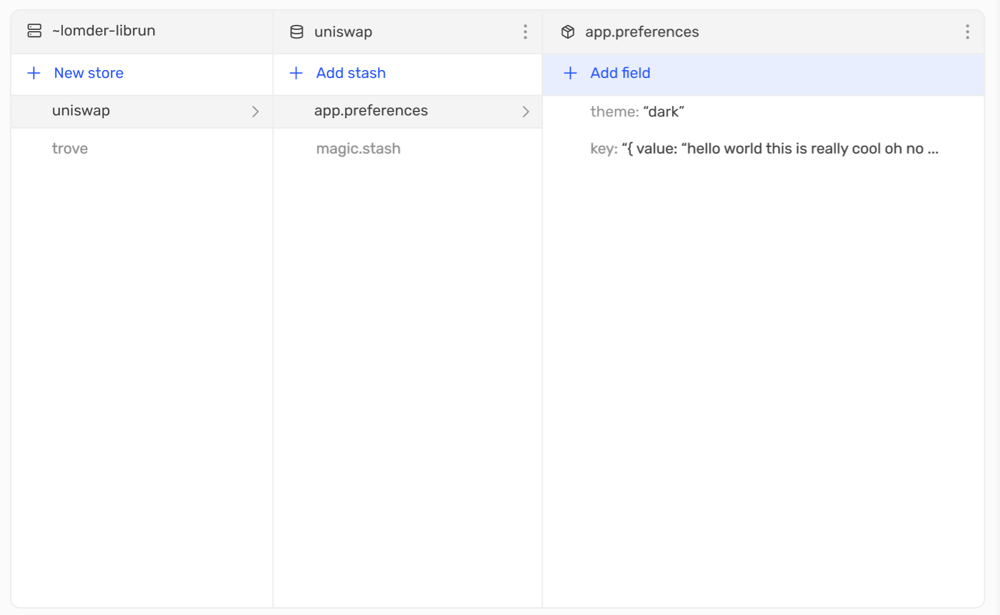
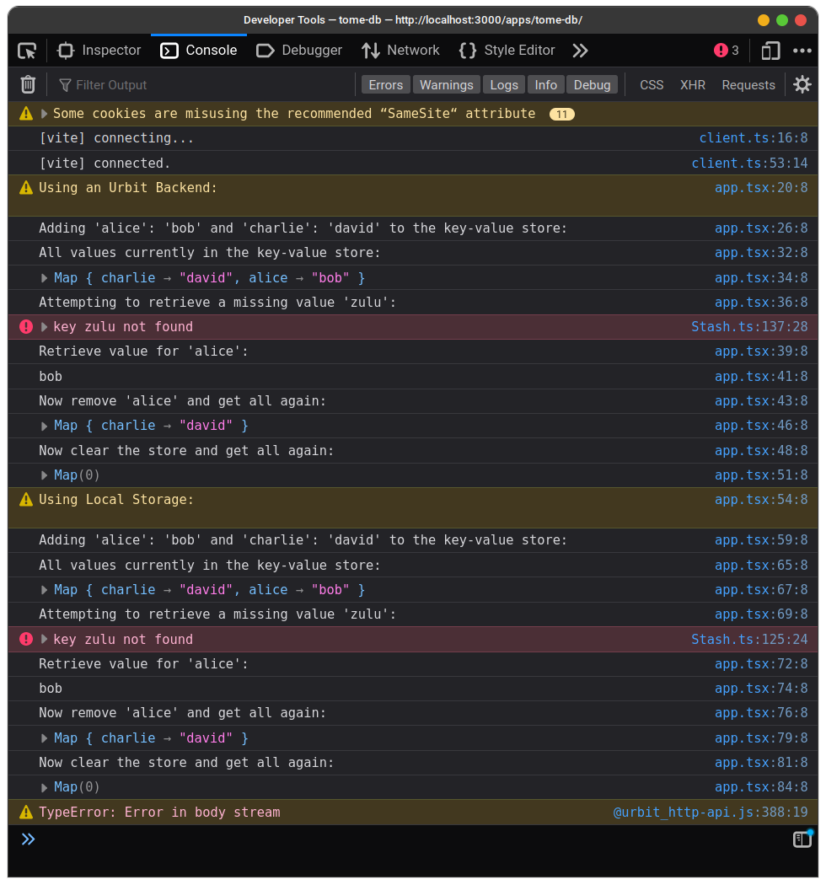

# tome-db

## Overview

tome-db is a javascript library and a gall agent. The javascript library implements data contracts defined by a gall agent so frontend developers can store any key-value pairs **without writing any Hoon**. It also serves double purpose for non-Urbit use cases, by using javascript `localStorage` when an Urbit API is not provided.

The current `@urbit/api` library does not achieve this goal as it is too tied to Landscape.

There are two portions of this project:

-   `tome-db`: a javascript library (NPM package) that implements the `%tome-api` pokes and scries. These pokes and scries follow a standard format. See code in the `/pkg` directory.
-   `%tome-api`: the main gall agent that handles the `@urbit/tome-db` requests, checks permissions, and responds with key-value pairs. See code at `/desk/app/tome-api.hoon`.

### Key-value methods:

-   set
-   get
-   remove
-   all: returns all key-value pairs
-   clear: clears the entire store of all key-value pairs.

An example script of the package being used is provided in `example.js`.

For more in-depth technical information, see `DESIGN.md`.

### Images

#### Mock Database Table

#### Example Script Output

